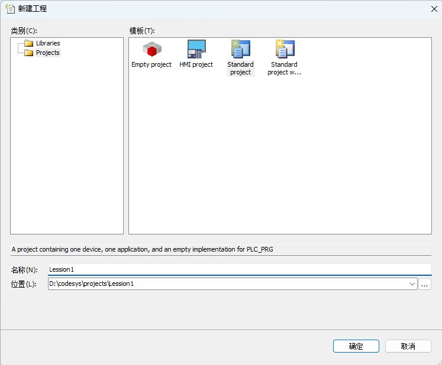
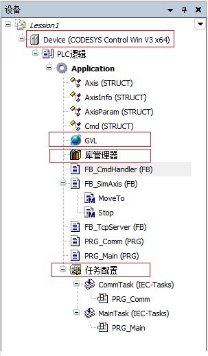
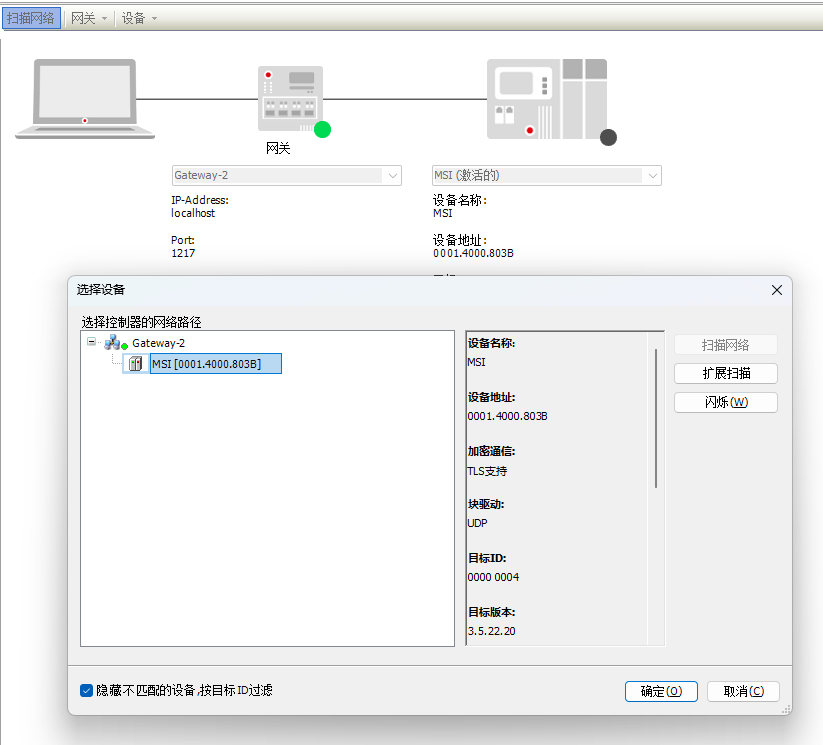
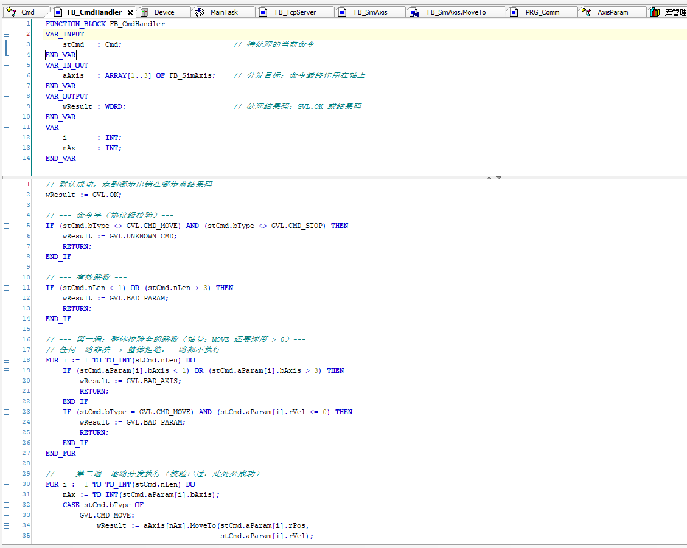
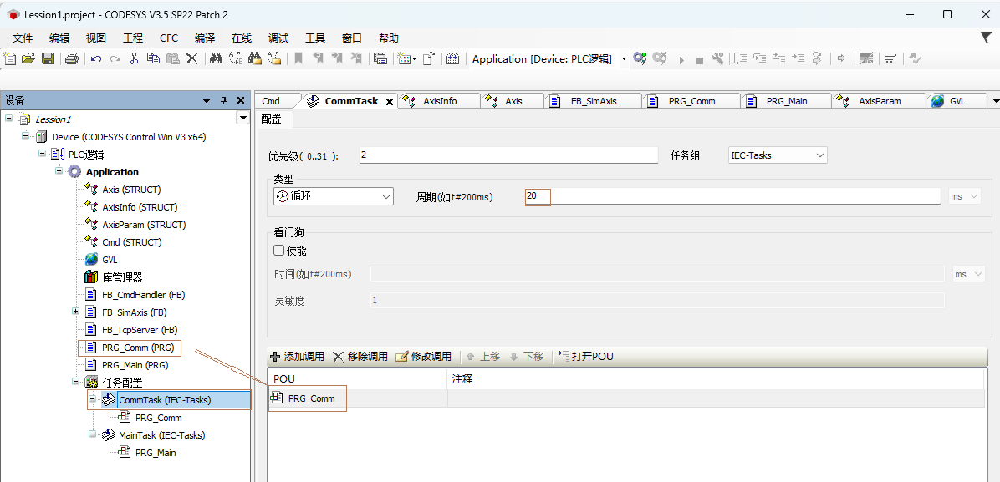
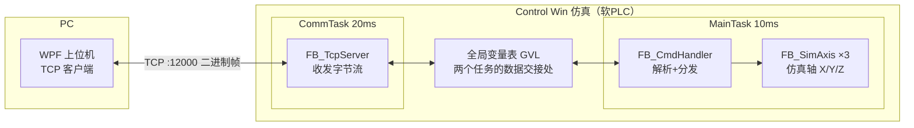
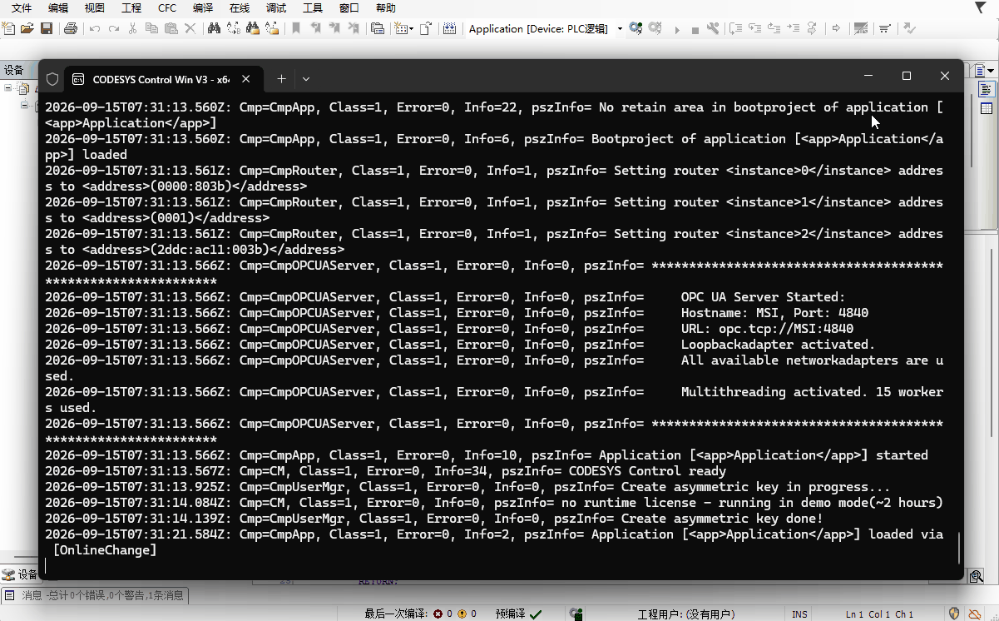

# Codesys 应用实践 - 上下位机闭环

> 环境：CODESYS V3.5 SP22 ｜ 运行目标：CODESYS Control Win V3 x64 仿真 ｜ 上位机：.NET 10 WPF

## 概述

动手写Codesys这个系列，希望从核心技术和实践应用上介绍下，围绕实践主体，系列完成能长出一棵可应用的树来。

Codesys不是新东西了，已经出来了很多年，它还算经典，IDE包括仿真器也都是免费的；对于初学者来说，可以从它入门来掌握控制及自动化方面的知识。

涉及到了技术，每一块展开都可以讲很多，本系列注重引路和展现，详细信息请网络搜索补全。

## 本章内容

搭建一个最小的上下位机闭环系统，下位机使用Codesys，上位机用C#（WPF）。

如果是个C#程序员，之前没接触过Codesys，可花1个小时把这个玩一圈。

## Codesys环境

可以在 CODESYS 官网商店 [store.codesys.com](https://store.codesys.com/en) 免费下载Codesys（需要注册账号），我下载的是 CODESYS V3.5 SP22 64位，下载后安装即可；

安装之后，有两个程序是需要的：

1. Codesys V3.5 SP22，类似于 Visual Studio， 是一个IDE，可以创建工程，编写代码等。
2. Codesys Control Win V3 - x64，程序运行仿真程序，代码编译之后，会下载进这个仿真程序中运行。它启动后在系统托盘里，是一个"软PLC"。

> 仿真器没有license也能跑，是demo模式，每次运行两小时后自动停止，重启一下就好，学习够用了。
>

## 工程

类似于Visual Studio的工程，进入Codesys IDE之后，可以创建工程，比如Standard Project，它会创建一个工程

（如图：新建 Standard project 对话框）



工程是以设备为中心的，有很多支持的设备，比如汇川伺服等等，仿真器（Codesys Control Win V3 - x64）就是仿真一个设备的。



工程里的东西挂在设备（Device）下面，主要分几类：

```text
设备（Device）
 └── 应用（Application）
      ├── 库管理器（Library Manager）      -- 管库
      ├── 任务配置（Task Configuration）   -- 管周期
      ├── 全局变量表（GVL）                -- 管数据
      └── 各种代码对象（STRUCT/FB/PRG）     -- 管逻辑
```

库就是Library，可以添加库（类似dll），Codesys默认提供了很多函数库（如socket库等），也可以自定义库添加；

任务配置是设置周期任务的，可以设置一个任务以10ms的间隔执行，一个任务以20ms的间隔执行——PLC程序不是"从头跑到尾"，而是被任务按周期一遍遍调用的，这是PLC编程和桌面编程最大的思维差别。

全局变量表（GVL）用来定义全局变量；代码可支持ST、梯形图等多种语言。

## 设备

设备连接需要扫描网络，发现设备，连接设备等，类似于Windows设备管理器，不同设备有不同的设备描述。

真实的设备，厂商会提供一个"设备描述文件"，把它导入Codesys之后，IDE才认识这个设备：它是什么型号、怎么跟它通信、有哪些参数可以配置。本章用的仿真器是Codesys自带的设备，不用导入。

双击项目中的设备（Device），会出来一个扫描网络界面，如果你启动了Codesys Control Win V3 - x64，这里会出现仿真设备

（如图：扫描网络找到仿真设备）



双击这个节点可以与其连接。

## 代码

Codesys支持的常用规范是IEC 61131-3，这是一个PLC编程的国际标准，里面定义了几种语言，本系列常用的是ST（Structured Text，结构化文本）；

ST的语法接近Pascal：赋值用 `:=`，有 `IF / CASE / FOR / WHILE`，写惯C#的人看两眼就会了。

Codesys里的代码对象主要分这几类：

| 类型 | 是什么 | 类比 |
| --- | --- | --- |
| PRG（程序） | 挂在任务上被周期调用的程序 | main函数，但每周期跑一遍 |
| FB（功能块） | 有内部状态的代码块，可以带方法 | 类 |
| FUN（函数） | 无状态，输入算输出 | 静态函数 |
| DUT | 自定义数据类型（结构体） | struct |
| GVL | 全局变量表 | 全局static变量 |

一个POU长这个样子：

（如图：POU编辑器，声明区+实现区）



上半区是声明区，声明输入、输出、内部变量，类似于.h头文件；

下半区是实现区，写逻辑，类似于.c代码。

> 关于各个文件的创建方法，可以Deepseek问一下；要注意的是任务配置，它需要添加【任务对象】，然后再【添加调用】选择对应的【PRG】程序



一种编写方式：

1. 创建PRG程序，添加任务，分配时间
2. 编写数据结构（STRUCT）
3. 编写GVL全局数据
4. 编写函数（FB - Function Block）
5. 在PRG程序中调用函数（FB）

## 上下位机架构

系统架构如下



本Sample模拟了三个轴，可让轴运动、停止。

两者通过TCP通讯，帧是个二进制包：上行命令帧（Cmd）30字节，下行汇报帧（AxisInfo）45字节，每200ms推一次三轴状态。

## 核心代码

架子的两处代码。

#### **第一处：轴结构体定义。**

Codesys侧用结构体定义帧格式（`pack_mode=1` 取消对齐填充，双端都是小端），线上的字节和内存里的结构体逐字节对应，"内存拷贝即协议"：

Codesys侧：

```iecst
{attribute 'pack_mode' := '1'}
TYPE Cmd :          // 上行帧，30字节
STRUCT
    bType  : BYTE;  // 命令头：1=MOVE 2=STOP
    bSub   : BYTE;  // 子命令，预留
    nLen   : BYTE;  // 有效路数
    aParam : ARRAY[1..3] OF AxisParam;  // 每路：轴号+位置+速度
END_STRUCT
END_TYPE
```

同样的结构体对应C#侧：

```csharp
[StructLayout(LayoutKind.Sequential, Pack = 1)]
public struct Cmd               // 上行帧，30 字节，与 PLC 侧逐字节对应
{
    public byte bType;          // 命令头：1=MOVE 2=STOP
    public byte bSub;           // 子命令：预留
    public byte nLen;           // 有效路数
    [MarshalAs(UnmanagedType.ByValArray, SizeConst = 3)]
    public AxisParam[] aParam;  // 每路：轴号+位置+速度
}
```

#### **第二处：Main函数**

```structured text
PROGRAM PRG_Main
VAR
    fbCmdHandler : FB_CmdHandler;
    fbAxis       : ARRAY[1..3] OF FB_SimAxis;   // 下标 = 轴号（1=X / 2=Y / 3=Z）
    i            : INT;
END_VAR

IF GVL.nCmdSeq <> GVL.nAckSeq THEN				// 如果收到新请求，调用FB_CmdHandler处理命令
    fbCmdHandler(stCmd := GVL.stCmd, aAxis := fbAxis);
    GVL.wResult := fbCmdHandler.wResult;
    GVL.nAckSeq := GVL.nCmdSeq;
END_IF
```

## 运行效果



## 验证方法

1. 启动 Codesys Control Win V3 x64。
2. IDE 登录仿真器、下载工程、运行。
3. 启动上位机 `dotnet run`，点"连接"，状态区开始每200ms刷新三轴位置。
4. 轴选X，位置100，速度50，点MOVE → X的位置以50/s爬升到100。
5. 点 MOVE XYZ → 一帧带3路参数，三根轴同时动。
6. 运动中点 STOP → 轴立即停住。
7. 断开再连接 → 状态帧恢复，连接不依赖中间状态。

## 代码地址

代码和文档在Github上：

[CodesPractice](https://github.com/zhouyongh/CodesysPractice)

Codesys 工程在 Lessons/Lesson1/codesys/Lesson1.project，可以用Codesys IDE打开工程即可；st目录是方便阅读的代码

