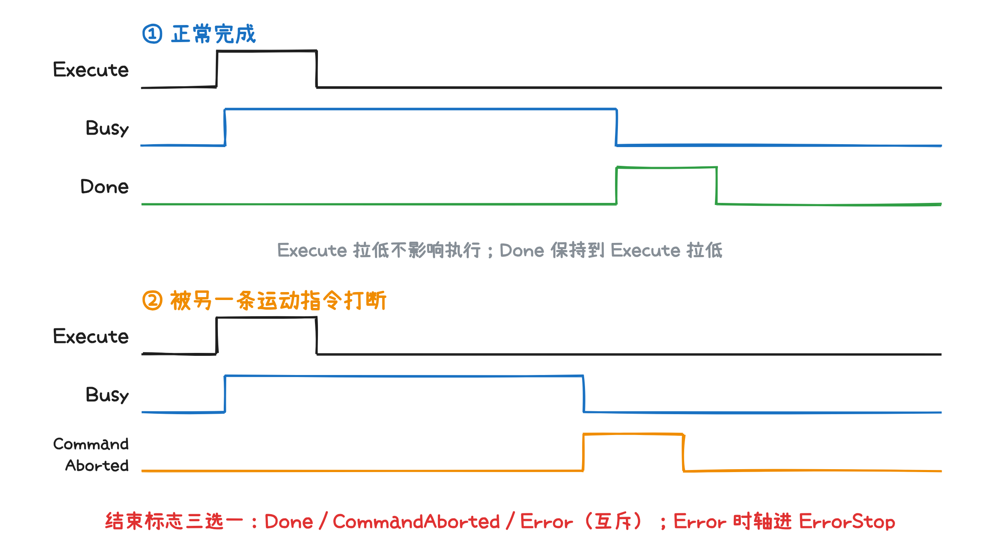
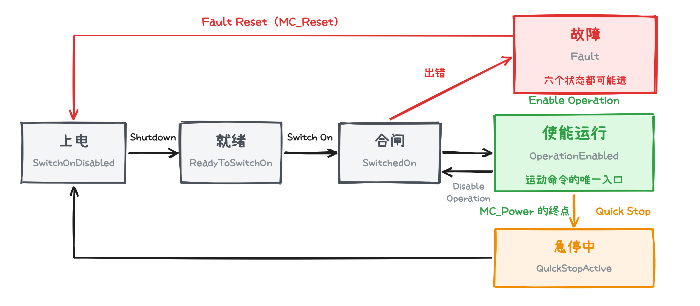
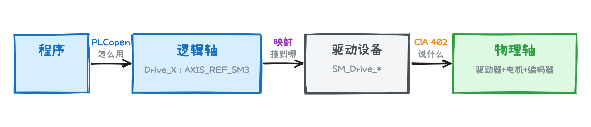
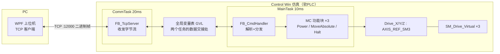

# Codesys 应用实践 - 轴

> 环境：CODESYS V3.5 SP22 ｜ 运行目标：CODESYS Control Win V3 x64 仿真

## 概述

上一课搭了最小的上下位机闭环：那三根轴是手搓的——FB_SimAxis 自己解析命令、自己爬位置；动作是真的，轴是假的。

这一课认识真轴。

## 轴是什么

先从运动控制说起，维基百科对运动控制的定义：

> **运动控制**是自动化技术的一部分，是指让系统中的**可动**部分以**可控**制的方式移动的系统或是子系统。

机床工作台、机械臂关节、传送带——都是某个自由度上的"动"。把一个既可动又可控的自由度封装成工程单元：能命名、能读状态、能下指令，就是**轴**。

前面定义里埋着两个字——**动**，**控**。

**谁动？谁控？**

## 动与控

动——区别开来；控——代入进去。

|  | 动 | 控 |
| --- | --- | --- |
| 是什么 | 驱动器、电机、机械 | 控制器、程序 |
| 入什么 | 能量 | 信息 |
| 出什么 | 运动 | 指令 |

动是硬的，控是软的；这种思想很通用，无论是软件控制硬件，弱电控制强电，都是这种套路的落地。

当然，不能将软硬两个世界强行“焊”在一起，要让它们各自独立，各自变化。

将轴封装——动的那侧封装成**物理轴**，控的那侧封装成**逻辑轴**。

## 物理轴与逻辑轴


- **物理轴**＝"动"侧的封装：驱动器 + 电机 + 编码器（+ 机械）
- **逻辑轴**＝"控"侧的封装：程序里的轴对象，物理轴在软件里的"代理"

中间靠**映射**绑定：一个逻辑，一个物理。（名实结合）

CODESYS 里，这对封装长这样：

- 设备树里挂一个驱动设备——现场伺服等，这是"实"；
- 添加设备时自动生成一根轴变量（如 `Drive_X : AXIS_REF_SM3`）——这是"名"；
- 程序用名控实。

有了逻辑轴了。**怎么用呢**？

## 跟轴打交道

使用面向对象的套路：**属性表状态，方法给操作**。

- 属性＝实际位置、实际速度、轴状态——读取；
- 方法＝功能块（MC_ 开头），第一参数都是轴——调用。

这套功能块是**软件侧**的统一语言：**PLCopen**（在Codesys中是`SM3_Basic` 库）。不管底下是什么驱动器，程序说的都是这一套语法：

| 功能块 | 干什么 |
| --- | --- |
| `MC_Power` | 使能/断使能，一切运动的前提 |
| `MC_Home` | 回零 |
| `MC_MoveAbsolute` | 绝对定位 |
| `MC_MoveRelative` | 相对定位 |
| `MC_MoveVelocity` | 恒速运行 |
| `MC_Stop` | 停止；Execute 保持期间锁定，别的指令进不来 |
| `MC_Halt` | 停止；停稳后可被新指令接管 |
| `MC_Reset` | 复位故障 |
| `MC_ReadActualPosition` | 读当前位置 |

这些MC块都是异步的，他们有一套公共的模型



**Execute 上升沿启动；Busy 表示执行中；结束时 Done / CommandAborted / Error 三选一，互斥**

在运动控制领域，要学会看上述的图；比如Busy和Execute，从时序上可以看出：在开始运动时，先一个周期Execute开始，第二个周期才Busy。

软件侧统一了。可逻辑轴底下挂的驱动器是**万国牌**——各有各的参数表、各有各的方言。**设备侧**也得有一种统一语言。

## 轴协议：CiA 402

**CiA 402**，就是驱动器界的一种普通话。

它跑在通信协议之上：通信协议管"字节怎么传"，402 管"字节什么意思"。

它有三个支柱：

1. **状态机**——驱动器的生命周期：上电→就绪→使能；故障→复位
2. **控制字/状态字**——一来一往的握手：控制器发令，驱动器回报
3. **操作模式**——干哪种活：定位 PP / 调速 PV / 回零 / 同步 CSP



上图是驱动器的生命周期，其中比较重要的是**使能运行**（OperationEnabled），简称为**OP**。一般说为，驱动器已经OP了，可以开始干活了。

在Codesys中，SoftMotion替你翻译 `MC_MoveAbsolute`，将它转换为CiA 402 的控制字；状态反之亦然

（虚拟轴 `SM_Drive_Virtual` 在仿真里完整模拟这套行为——仿真环境里学的，就是真行为。）

## 合起来



三处交界，三份契约：

- **PLCopen**：程序 ↔ 轴（怎么用）
- **映射**：逻辑 ↔ 物理（接到哪）
- **CiA 402**：控制器 ↔ 驱动器（说什么）

契约各守各的：任何一侧被替换，另一侧不动——**换驱动器，不改程序**。这是下一节 Demo 的根据。

## Demo

在上一课的架子的基础上，加三根轴 X/Y/Z，把假的换成真的——FB_SimAxis 换成 SoftMotion 轴。

### 架构：只换一处



对比上一课的架构图：FB_SimAxis ×3 → MC 功能块 + 虚拟轴。命令帧、状态帧、上位机——一行不动；GVL 里多出的，只是设备自动生成的三根轴变量。

### 搭轴

1. 设备树添加三根 SoftMotion 虚拟轴 `SM_Drive_Virtual`，设备名取 `Drive_X / Drive_Y / Drive_Z`，对应上一课的 X/Y/Z；
2. 各自自动生成轴变量 `Drive_X/Y/Z : AXIS_REF_SM3`；
3. 登录仿真器，下载，运行。

### 核心改动：命令帧 → MC 功能块

调度骨架不动——新命令仍走"校验 → 分发"，状态仍由 PRG 每周期发布；动的只是轴的调法。

**每根轴一套功能块。** MC 块内部有状态，不能三根轴共用：

```structured text
fbPower : ARRAY[1..3] OF MC_Power;         // 使能，常驻
fbMove  : ARRAY[1..3] OF MC_MoveAbsolute;  // 绝对定位
fbHalt  : ARRAY[1..3] OF MC_Halt;          // 停止
aCmd    : ARRAY[1..3] OF ST_AxisCmd;       // 命令槽：装弹 + 给沿
// aAxis[1..3] ← Drive_X/Y/Z : AXIS_REF_SM3，设备添加时自动生成，工程里接一次引用
```

**电平命令 → 沿触发。** TCP 帧里的 MOVE 是"一条命令"；MC 的 Execute 是"一个上升沿"。给沿用一拍脉冲：调用当拍拉高，随后立刻拉低。运动中再来一帧 MOVE，重新给沿——旧指令以 CommandAborted 收场（不是故障，正是上面时序图的第二种波形），轴按新目标走。上一课"运动中改目标"的手感，由此保住：

```structured text
// PRG_Main 每周期三步：
// ① 使能常驻
FOR i := 1 TO 3 DO
    fbPower[i](Axis := aAxis[i], Enable := TRUE,
               bRegulatorOn := TRUE, bDriveStart := TRUE);
END_FOR

// ② 来了新帧（nCmdSeq <> nAckSeq）：校验后装弹、给沿
//    MOVE → 记下 aCmd[n].rPos / rVel，aCmd[n].xMoveTrig := TRUE
//    STOP → aCmd[n].xHaltTrig := TRUE

// ③ 调用运动块，Execute 接命令槽的沿，一拍脉冲
fbMove[n](Axis := aAxis[n], Execute := aCmd[n].xMoveTrig,
          Position := aCmd[n].rPos, Velocity := aCmd[n].rVel,
          Acceleration := 500, Deceleration := 500);
fbHalt[n](Axis := aAxis[n], Execute := aCmd[n].xHaltTrig);
aCmd[n].xMoveTrig := FALSE;  aCmd[n].xHaltTrig := FALSE;   // 当拍拉低，下一帧再给沿
```

## 运行效果

（动图：工程完成后录制——WPF 照旧，点 MOVE XYZ，三根虚拟轴同时走到位。）

## 验证方法

1. 启动 Codesys Control Win V3 x64，登录仿真器、下载、运行；
2. 启动上位机 `dotnet run`（上一课的 WPF，原样），点"连接"，状态区每 200ms 刷新三轴位置；
3. 轴选 X，位置 100，速度 50，点 MOVE → X 以 50/s 爬升到 100；
4. 运动中再点 MOVE 改个目标 → X 转向新目标——运动中改目标，和上一课手感一致；
5. 点 MOVE XYZ → 一帧带 3 路参数，三根轴同时动；
6. 运动中选一根轴点 STOP → 只有它停住（STOP 帧只带一路），再 MOVE 照常；
7. 双击 Drive_X 打开轴编辑器在线页：状态在 Standstill ↔ Discrete Motion 间切换，与指令一一对应。

## 代码地址

代码和文档在Github上：

[CodesPractice](https://github.com/zhouyongh/CodesysPractice)

Codesys 工程在 Lessons/Lesson2/codesys/Lesson2.project，可以用Codesys IDE打开工程即可；st目录是方便阅读的代码
